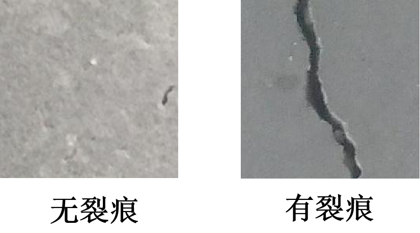
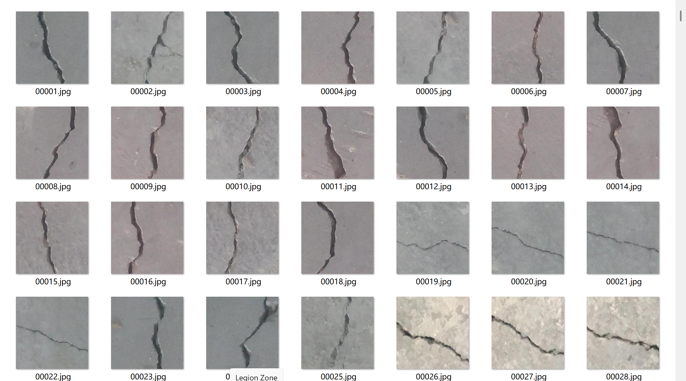
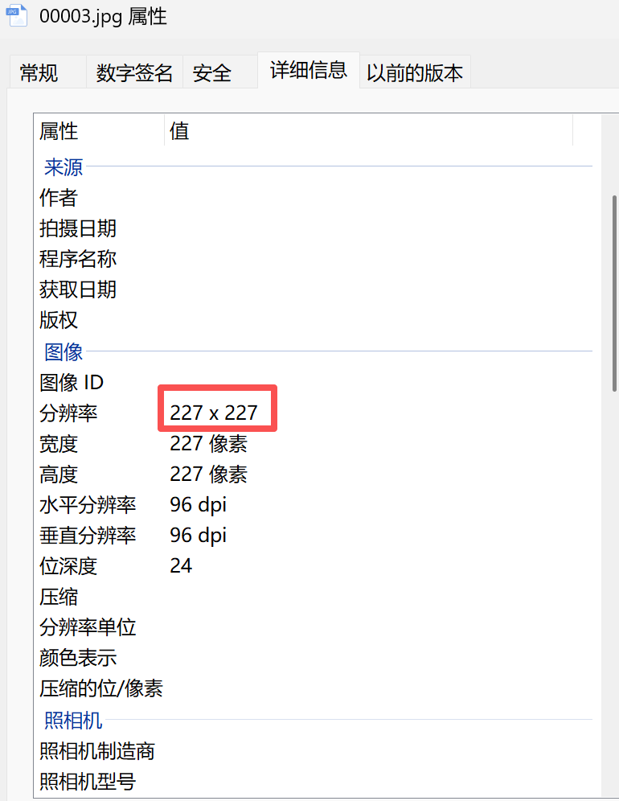
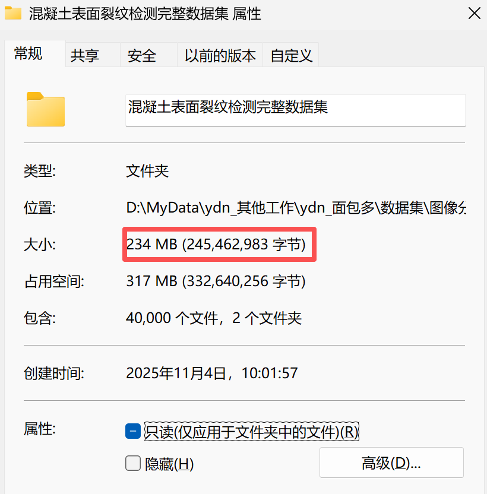

# Crack Detection in Concrete Surfaces - Image Classification Dataset

Cracked concrete surfaces are a major defect in civil buildings.  
Buildings inspections are conducted to assess the building's stiffness and tensile strength.  
Crack detection plays a crucial role in identifying cracks and determining the health of buildings.  
The number of images in the Negative folder: 20,000  
The number of images in the Positive folder: 20,000  
The total number of images in all subfolders: 40,000  
The dataset consists of 20,000 images with cracks in concrete structures and 20,000 images without cracks.  
This dataset was generated from 458 high-resolution images (4032x3024 pixels).  
Each image in the dataset is a 227 x 227 RGB image.  
Below are some example images with and without cracks:  
The dataset contains a wide variety of images - plates of different colors, cracks of varying intensity and shape.  
For inquiries, simply ask your question and I can see it.  
Search for me, and send your questions at once. I will respond to you, sometimes I am busy, you just describe your problem and intention clearly.  
I will also reply to you when I have time, no need for formalities, so that we can communicate more efficiently.  
Phone numbers are also mentioned above, if I forget to respond or you are impatient, you can text or call me.
## Images

Here is a pay link on Stripe ( https://buy.stripe.com/3cs8yP7sY87d0vu9AB ). Please contact me lonlonago@foxmail.com after funding $89, and I will send you a complete data files , thank you!

